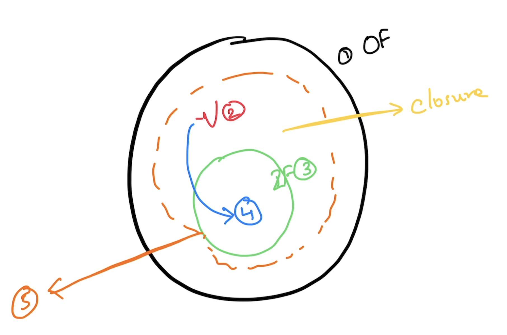
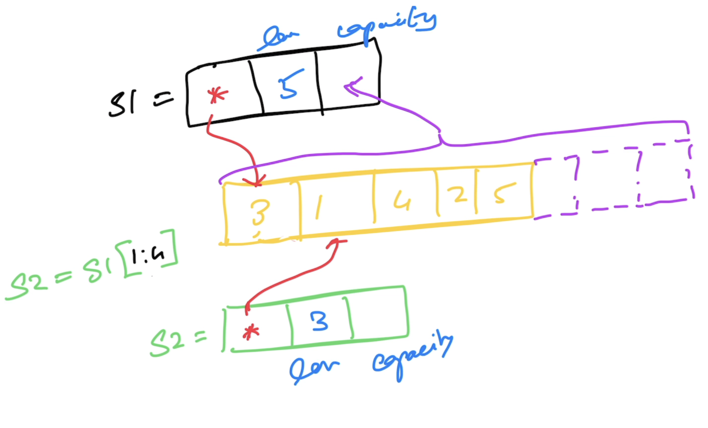

# Go lang

## Magesh Kuppan
- tkmagesh77@gmail.com

## Schedule
Commence    : 9:30 AM 
Tea Break   : 11:00 AM (20 mins)
Lunch Break : 1:00 PM (1 hour)
Tea Break   : 3:30PM (20 mins)
Wind up     : 5:30 PM

## Software Requirements
- Go tools (https://go.dev/dl)
```shell
go version
```
- Visual Studio Code

## Methodology
- No powerpoint

## Repository
- https://github.com/tkmagesh/adobe-go-may-2025

## Prerequisites
- Go program structure
- Data Types
- Variables, Constants, iota
- if else, switch case, for
- error handler
- panic & recovery

## Data Types
- string
- bool
- integers
    - int8
    - int16
    - int32
    - int64
    - int
- unsigned integers
    - uint8
    - uint16
    - uint32
    - uint64
    - uint
- floating points
    - float32
    - float64
- complex
    - complex64 ( real[float32] + imaginary[float32] )
    - complex128 ( real[float64] + imaginary[float64] )
- alias
    - byte (alias for unsigned int)
    - rune (alias for unicode code point)

### Zero values
| Data Type | Zero value |
------------ | ------------- |
|int family     | 0 |
|uint family    | 0 |
|complex family | (0+0i) |
|string         | "" (empty string) |
|bool           | false |
|byte           | 0 |
|interface      | nil |
|pointer        | nil |
|function       | nil |
|struct         | struct instance |

## Functions
1. Named Results (Return more than one result)
2. Variadic functions
3. Anonymous functions
4. Higher Order functions (to treat functions like data)
    - Assign functions as values to variables
    - Pass functions as arguments
    - Return functions as return values
    - Can be treated as "types"
5. Deferred functions
6. Closures


## Collection
### Array
- Fixed sized typed collection
### Slice
- Varying sized typed collection

### Map
- Typed collection of key/value pairs


